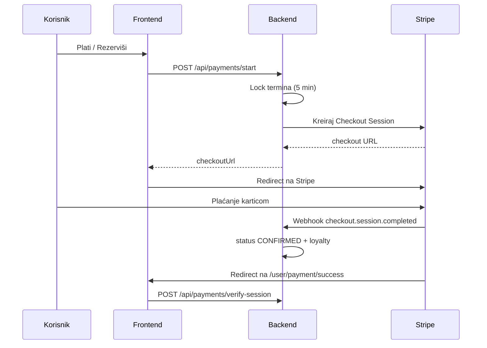

# MojTeren

Web aplikacija za **rezervaciju i upravljanje sportskim terenima**. Podržava tri uloge — **korisnik**, **radnik** i **vlasnik** — s pregledom dostupnosti po satima, online plaćanjem (Stripe), loyalty programom, obavijestima, mapom terena i izvještajima.

- **Frontend:** [http://localhost:5173](http://localhost:5173)
- **Backend API:** [http://localhost:5000/api](http://localhost:5000/api)
- **Repozitorij:** [github.com/fatmir12/MojTeren](https://github.com/fatmir12/MojTeren)

---

## Sadržaj

1. [O projektu](#o-projektu)
2. [Tehnologije](#tehnologije)
3. [Preduvjeti](#preduvjeti)
4. [Instalacija i pokretanje](#instalacija-i-pokretanje)
5. [Stripe plaćanje](#stripe-plaćanje)
6. [Uloge i nalozi](#uloge-i-nalozi)
7. [Funkcionalnosti po ulozi](#funkcionalnosti-po-ulozi)
8. [Tok rezervacije i plaćanja](#tok-rezervacije-i-plaćanja)
9. [Rute u aplikaciji](#rute-u-aplikaciji)
10. [API pregled](#api-pregled)
11. [Struktura projekta](#struktura-projekta)
12. [Pohrana podataka](#pohrana-podataka)
13. [Poslovna pravila](#poslovna-pravila)
14. [Git i timski rad](#git-i-timski-rad)
15. [Rješavanje problema](#rješavanje-problema)
16. [Skripte](#skripte)

---

## O projektu

MojTeren omogućava:

- **Korisnicima** — pregled terena na mapi, rezervaciju termina, plaćanje karticom, historiju, loyalty bodove, favorite i recenzije.
- **Radnicima** — upravljanje terminima, zaključavanje satnica, pregled rezervacija i dodjelu posebnih profila (sportski klub / licencirani trener).
- **Vlasnicima** — CRUD objekata i radnika, dashboard i finansijske izvještaje.

UI je na **bosanskom** jeziku. Dizajn koristi **Plus Jakarta Sans** i teal paletu.

---

## Tehnologije

| Sloj | Tehnologije |
|------|-------------|
| **Frontend** | React 19, Vite 8, React Router 7, Axios, Tailwind CSS 4, Leaflet (mapa) |
| **Backend** | Node.js, Express 5, Stripe SDK, dotenv |
| **Podaci** | JSON datoteka (`backend/src/data/mockData.json`) |
| **Plaćanje** | Stripe Checkout (hostovana stranica) |
| **Real-time** | Server-Sent Events (`/api/events`) za osvježavanje termina |

> Ovo je **razvojna** verzija: nema prave baze podataka ni JWT autentifikacije. Lozinke se čuvaju u plain textu u JSON-u — **ne koristiti u produkciji** bez prilagodbi.

---

## Preduvjeti

- **Node.js** 18+ (preporučeno 20+)
- **npm**
- **Stripe nalog** (test mode) — za online plaćanje
- **Stripe CLI** (opciono) — za webhook na lokalnom računaru

---

## Instalacija i pokretanje

Potrebna su **dva terminala** (frontend + backend).

### 1. Kloniranje repozitorija

```bash
git clone https://github.com/fatmir12/MojTeren.git
cd MojTeren
```

### 2. Frontend (root folder)

```bash
npm install
npm run dev
```

Aplikacija: **http://localhost:5173**

### 3. Backend

```bash
cd backend
npm install
```

Kreiraj `backend/.env` (vidi [Stripe plaćanje](#stripe-plaćanje)):

```env
STRIPE_SECRET_KEY=sk_test_tvoj_kljuc
STRIPE_WEBHOOK_SECRET=whsec_tvoj_webhook_secret
FRONTEND_URL=http://localhost:5173
```

Pokreni server:

```bash
npm run dev
```

API: **http://localhost:5000**

U konzoli backend-a treba pisati:

```text
Server radi na portu 5000
Stripe: konfiguriran
```

Ako piše `Stripe: NEDOSTAJE STRIPE_SECRET_KEY`, provjeri `.env` i restartuj backend.

### 4. Produkcijski build (frontend)

```bash
npm run build
npm run preview
```

---

## Stripe plaćanje

Plaćanje radi preko **Stripe Checkout** — korisnik se preusmjerava na Stripe stranicu, ne unosi karticu u našoj aplikaciji.

### Šta instalirati

Samo u **`backend/`** (već u `package.json`):

```bash
cd backend
npm install   # uključuje paket stripe
```

Na frontendu **nije** potreban `@stripe/stripe-js`.

### Konfiguracija

| Varijabla | Opis |
|-----------|------|
| `STRIPE_SECRET_KEY` | Tajni ključ iz Stripe Dashboard → Developers → API keys (`sk_test_...`) |
| `STRIPE_WEBHOOK_SECRET` | Signing secret za webhook (`whsec_...`) |
| `FRONTEND_URL` | URL frontenda za redirect nakon plaćanja (npr. `http://localhost:5173`) |

Fajl **`backend/.env` nikad ne commitaj** — već je u `.gitignore`.

### Webhook (lokalno)

U trećem terminalu, dok backend radi:

```bash
stripe login
stripe listen --forward-to localhost:5000/api/payments/webhook
```

Kopiraj ispisani `whsec_...` u `STRIPE_WEBHOOK_SECRET` i restartuj backend.

### Test kartica

Na Stripe Checkout stranici:

- Broj: `4242 4242 4242 4242`
- Datum: bilo koji budući
- CVC: bilo koji 3 broja

Valuta u checkoutu: **BAM**.

---

## Uloge i nalozi

| Uloga | Kod | Kako doći do naloga |
|-------|-----|---------------------|
| **Vlasnik** | `OWNER` | Ručno u `mockData.json` ili zadani početni nalog (vidi ispod) |
| **Radnik** | `WORKER` | Vlasnik ga dodaje u **Objekti → Radnici** (default lozinka `123456`) |
| **Korisnik** | `USER` | Registracija na `/register` |

### Početni vlasnik (ako postoji u mockData)

Ako u `backend/src/data/mockData.json` postoji korisnik s ulogom `OWNER`:

| Email | Lozinka | Uloga |
|-------|---------|-------|
| `Fatmir@test.com` | `123456` | Vlasnik |

*(Podaci zavise od sadržaja `mockData.json` — nakon resetiranja moraš kreirati naloge iznova.)*

### Registracija korisnika

`POST /api/auth/register` kreira nalog s ulogom **`USER`** (ne vlasnik).

Radnik dobija pristup tek kad ga vlasnik doda; login email + lozinka `123456` (dok radnik ne promijeni lozinku ručno u JSON-u).

---

## Funkcionalnosti po ulozi

### Korisnik (USER)

- Početna stranica: favoriti, brza rezervacija, loyalty, obavijesti
- **Tereni i rezervacije** — mapa (Leaflet), filteri, pregled 7 dana, modal rezervacije po satima
- **Online plaćanje** — Stripe Checkout, lock 5 minuta dok se ne plati
- **Historija** — statusi rezervacija, otkazivanje, **Nastavi plaćanje** za neplaćene
- **Profil** — loyalty bodovi, podsjetnici
- **Posebni profili** (ako radnik dodijeli): Sportski klub, Licencirani trener

### Radnik (WORKER)

- Dashboard i dnevni raspored
- Upravljanje **rezervacijama** (pregled, statusi)
- **Termini** — generisanje sedmice, satnice, djelimično/cjelodnevno zaključavanje
- **Posebni profili** — dodjela tipa korisniku (sportski klub / licencirani trener)

### Vlasnik (OWNER)

- Dashboard sa statistikom
- **Objekti** — dodavanje terena (naziv, grad, sport, lokacija na mapi)
- **Radnici** — dodavanje i uređivanje
- **Izvještaji** — popunjenost, prihod po objektu i mjesecu

---

## Tok rezervacije i plaćanja



### Statusi rezervacije

| Status | Značenje |
|--------|----------|
| `CREATED` | Kreirana (kratko prije plaćanja) |
| `WAITING_PAYMENT` | Čeka plaćanje (lock aktivan, max ~5 min) |
| `CONFIRMED` | Plaćeno i potvrđeno |
| `CANCELLED` | Otkazano (korisnik, timeout plaćanja, radnik…) |

Ako plaćanje ne završi u roku, lock ističe, rezervacija se otkazuje (`PAYMENT_TIMEOUT`) i korisnik dobija obavijest.

---

## Rute u aplikaciji

### Javno

| Putanja | Opis |
|---------|------|
| `/login` | Prijava |
| `/register` | Registracija (USER) |

### Korisnik

| Putanja | Opis |
|---------|------|
| `/user/home` | Početna |
| `/user/courts` | Tereni, mapa, rezervacija |
| `/user/history` | Historija i plaćanje |
| `/user/profile` | Profil |
| `/user/payment/success` | Uspješno plaćanje |
| `/user/payment/cancel` | Otkazano plaćanje |
| `/user/licencirani-trener` | Posebni profil (trener) |
| `/user/sportski-klub` | Posebni profil (klub) |

### Radnik

| Putanja | Opis |
|---------|------|
| `/worker/dashboard` | Dashboard |
| `/worker/reservations` | Rezervacije |
| `/worker/schedule` | Raspored |
| `/worker/terms` | Termini i zaključavanje |
| `/worker/special-profiles` | Posebni profili |
| `/worker/profile` | Profil |

### Vlasnik

| Putanja | Opis |
|---------|------|
| `/owner/dashboard` | Dashboard |
| `/owner/objects` | Objekti (tereni) |
| `/owner/workers` | Radnici |
| `/owner/reports` | Izvještaji |

---

## API pregled

Baza: `http://localhost:5000/api`

### Autentifikacija

```
POST /auth/login
POST /auth/register
```

### Objekti

```
GET    /objects
POST   /objects
PUT    /objects/:id
DELETE /objects/:id
```

### Termini

```
GET    /terms
POST   /terms
POST   /terms/week              # generisanje sedmice
PUT    /terms/:id
POST   /terms/:id/lock          # zaključaj cijeli dan
POST   /terms/:id/lock-slots    # djelimično zaključavanje
POST   /terms/:id/unlock-slots
DELETE /terms/:id
```

### Rezervacije

```
GET    /reservations
POST   /reservations
POST   /reservations/:id/cancel
PUT    /reservations/:id
DELETE /reservations/:id
```

### Plaćanje (Stripe)

```
POST /payments/start           # nova rezervacija + checkout URL
POST /payments/resume          # nastavak plaćanja (historija)
POST /payments/verify-session  # potvrda nakon redirecta
POST /payments/abandon         # odustajanje od plaćanja
POST /payments/webhook         # Stripe webhook (raw body)
POST /payments/mock/confirm    # test bez Stripea
```

### Radnici

```
GET    /workers
POST   /workers
PUT    /workers/:id
DELETE /workers/:id
```

### Ostalo

```
GET  /notifications
PUT  /notifications/read-all
PUT  /notifications/:id/read

GET  /reviews
POST /reviews

GET  /favorites?userId=
POST /favorites/toggle

GET  /loyalty?userName=
PUT  /loyalty/reminders

GET  /users
GET  /users/:id

POST /special-profiles/assign

GET  /events                    # SSE stream
```

---

## Struktura projekta

```
MojTeren/
├── public/                     # PWA, logo, service worker
├── src/
│   ├── components/             # Navbar, Sidebar, BookingModal, mapa…
│   ├── context/                # AuthContext, ToastContext
│   ├── layouts/                # Owner, Worker, User
│   ├── pages/
│   │   ├── auth/               # Login, Register
│   │   ├── owner/              # Dashboard, Objects, Workers, Reports
│   │   ├── worker/             # Terms, Reservations, SpecialProfiles…
│   │   └── user/               # Courts, History, Payment…
│   ├── routes/AppRoutes.jsx
│   ├── services/api.js         # Axios → localhost:5000/api
│   ├── styles/
│   └── utils/                  # slotUtils, cancellationUtils, geocoding…
├── backend/
│   └── src/
│       ├── config/fileStorage.js
│       ├── controllers/        # auth, payment, term, reservation…
│       ├── routes/
│       ├── services/           # lockService, eventBus, notifications
│       ├── utils/
│       ├── data/mockData.json  # „baza“ podataka
│       ├── loadEnv.js          # učitavanje backend/.env
│       └── server.js
├── package.json                # frontend
└── README.md
```

---

## Pohrana podataka

Svi podaci su u **`backend/src/data/mockData.json`**:

```json
{
  "objects": [],
  "terms": [],
  "workers": [],
  "reservations": [],
  "users": [],
  "notifications": [],
  "reviews": [],
  "favorites": [],
  "locks": []
}
```

### Reset na „prazno“ stanje

Isprazni nizove u `mockData.json` (ostavi strukturu). Zadrži barem jednog **OWNER** korisnika ako želiš odmah pristup vlasničkom panelu.

Nakon izmjene **restartuj backend** i **odjavi se** u browseru (ili obriši Local Storage za `localhost`).

---

## Poslovna pravila

| Pravilo | Ponašanje |
|---------|-----------|
| **Otkazivanje** | ≥ 24h prije termina → povrat novca i loyalty bodova |
| **Lock plaćanja** | 5 minuta; ako se ne plati → `CANCELLED`, termin slobodan |
| **Zaključan sat/dan** | Nema novih rezervacija; postojeće se mogu otkazati s obavijesti |
| **Loyalty** | 10 bodova po satu potvrđene rezervacije |
| **Preklapanje** | Rezervacija ne smije preklapati lock ili druge aktivne rezervacije |

---

## Git i timski rad

### Šta pushati

- Izvorni kod (`src/`, `backend/src/`)
- `package.json`, `package-lock.json`

### Šta **ne** pushati

| Fajl | Razlog |
|------|--------|
| `backend/.env` | Stripe tajni ključevi |
| `node_modules/` | Dependencies |
| `dist/` | Build |

### Preporučeni tok

```bash
git pull origin main
# radi na kodu…
git add .
git status                    # provjeri da nema .env
git commit -m "Opis promjene"
git push origin main
```

### Novi član tima

```bash
git pull
npm install
cd backend && npm install
# kreiraj backend/.env s vlastitim Stripe test ključevima
npm run dev   # backend
# u drugom terminalu, iz roota: npm run dev
```

---

## Rješavanje problema

| Problem | Rješenje |
|---------|----------|
| Nema Stripe prozora | Provjeri `backend/.env`, restartuj backend, u konzoli mora biti `Stripe: konfiguriran` |
| „Čeka plaćanje“ u historiji | Klik **Nastavi plaćanje** ili otkaži i rezerviši ponovo |
| Backend 503 na plaćanje | Nedostaje `STRIPE_SECRET_KEY` u `.env` |
| Stari login nakon reset mockData | Odjavi se / obriši Local Storage |
| CORS / API greška | Backend mora raditi na portu **5000** |
| Webhook ne radi lokalno | Pokreni `stripe listen --forward-to localhost:5000/api/payments/webhook` |

---

## Skripte

| Komanda | Gdje | Opis |
|---------|------|------|
| `npm run dev` | root | Frontend (Vite) |
| `npm run build` | root | Produkcijski build |
| `npm run lint` | root | ESLint |
| `npm run preview` | root | Pregled builda |
| `npm run dev` | `backend/` | Backend (nodemon) |

---

## Autori

Fatmir Kurtisi i tim (MojTeren)

---

*Za pitanja oko Stripe test okruženja: [Stripe dokumentacija](https://docs.stripe.com).*
